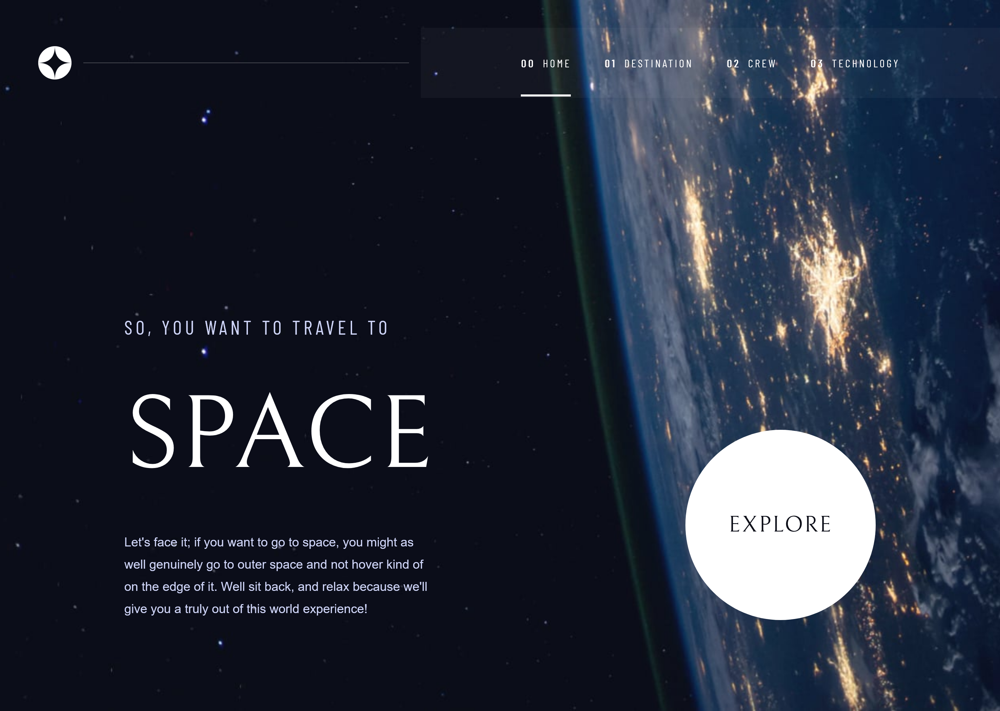
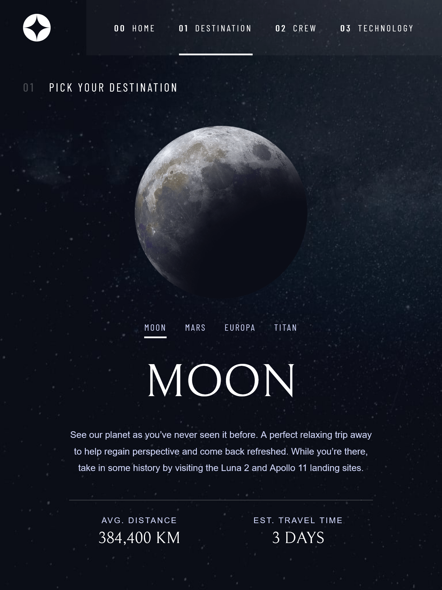

# 🚀 Space Tourism Website

Este é um projeto desenvolvido com **React + TypeScript + SCSS Modules** baseado no desafio do Frontend Mentor: [Space Tourism Website](https://www.frontendmentor.io/challenges/space-tourism-multipage-website-gRWj1URZ3).

## 📸 Demonstração





## ⚙️ Tecnologias utilizadas

- [React](https://reactjs.org/)
- [TypeScript](https://www.typescriptlang.org/)
- [Vite](https://vitejs.dev/)
- [Framer Motion](https://www.framer.com/motion/)
- [SCSS Modules](https://sass-lang.com/)

---

## 🚀 Como rodar localmente

1. Clone o repositório:
   ```
   git clone https://github.com/carlosdamaia/webchallenge-space-tourism
   ```

   Instale as dependências:

   ```
   npm install
   ```
   Rode o projeto:
   
   ```
   npm run dev
   ```

📦 Build para produção

npm run build

✨ Funcionalidades

    Navegação entre páginas (Home, Destino, Tripulação e Tecnologia)

    Layout responsivo (Mobile, Tablet e Desktop)

    Transições animadas entre conteúdos

    Componente reutilizável de tabs e imagens animadas

📁 Dados

Os dados estão localizados no arquivo `src/assets/data.json`: